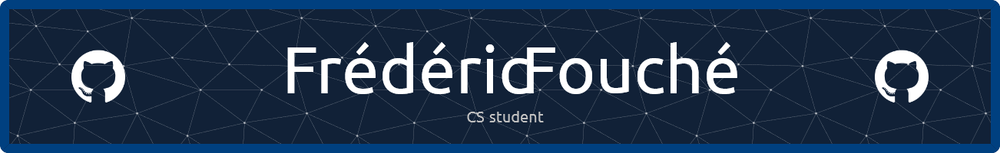

# Welcome to my Github profile

👋 I'm Frédéric, a student in Web Development at O'clock School. I'm passionate about web development, computer science and electronics. From a young age, I was assembling computers, always driven by a desire to understand how things work and to see how they are made. This curiosity has been a significant motivator in my learning journey.

🌱 I'm currently learning JavaScript, Node.js, Express, Jest, and PostgreSQL in school. On the side, I'm diving into Vue.js, TypeScript, NestJS, and Redis to improve my skills and to be more versatile.

🔨 I am in the process of developing my portfolio website using Vue.js and Tailwind CSS. For the backend, I'm utilizing Node.js, Express, and PostgreSQL, structured around a RESTful architecture. The entire setup is automated for deployment and testing through GitHub Actions and Docker, and it's hosted on my Virtual Private Server (VPS).

💡 I'm interested in API design, security, and architecture, and I'm always looking for new challenges to improve my skills. DevOps  and CI/CD  are also areas I'm interested in, and I'm always looking for ways to improve my workflow and automate repetitive tasks.

🔍 I'm looking for an internship in web development to improve my skills and learn new ones. Post-studies, I'm aiming for a job as a web developer 👨‍💻.

## Technologies

### Frontend

 

### Backend

 

 

### Tools

 

 

## Contact me

You can contact me via LinkedIn. I'm open to any opportunity, so don't hesitate 👋.

## My GitHub stats

