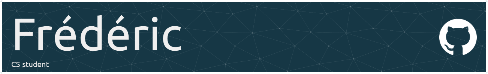

# Welcome to my Github profile

Hi, I’m Frédéric, a fullstack web developer with a passion for web development, computer science, and electronics. From a young age, I was assembling computers, always driven by a desire to understand how things work and to see how they are made. This curiosity has been a significant motivation in my learning journey.
I’m interested in API design, security, and architecture. Always eager to take on new challenges to enhance my skills.

## Technologies

### Frontend

 

### Backend

 

### Tools

 

 

## Contact me

